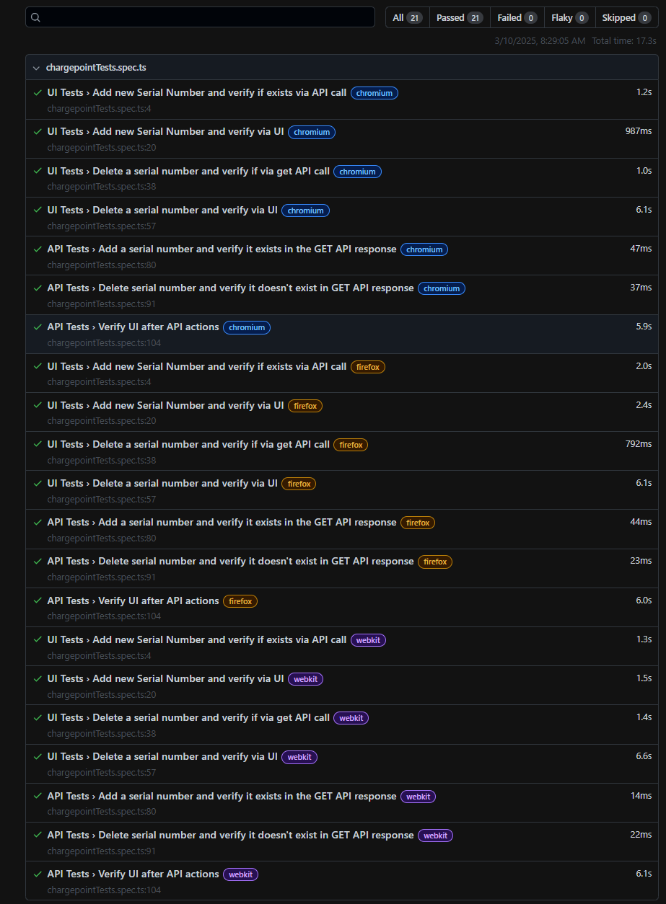
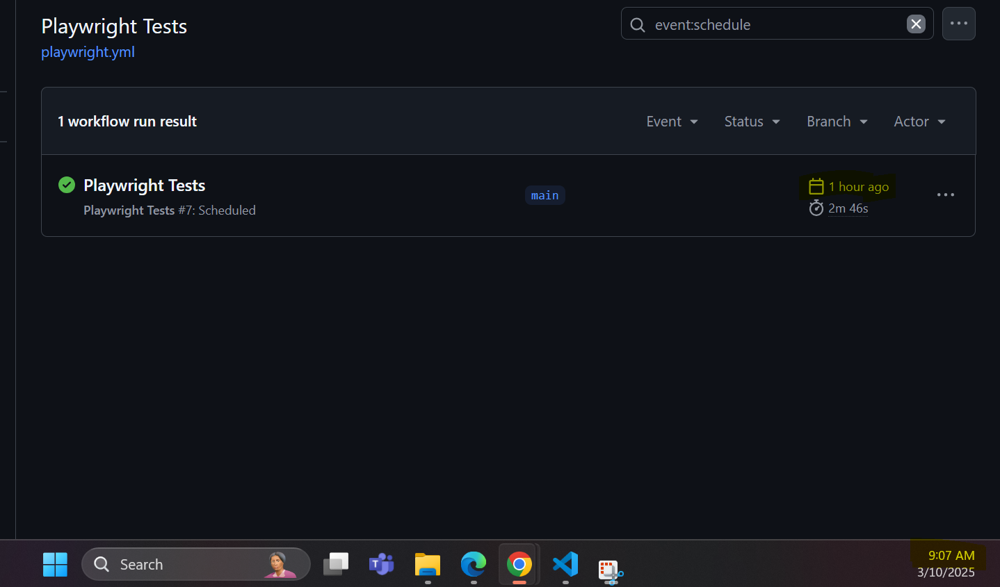

# Charge Point Installation App

App to support electricians in setting up a new charge point infrastructure.

The app allows the electricians to inform us about all the installed charge points, using their serial numbers.

The following functionalities are available:
- Visualize list of installed charge points 
- Adding a new charge point using serial number
- Remove a charge point from the installation

The app is composed of 2 components:
- Web application
- REST API

In order to run the app, you need to have nodejs installed.

To run it, execute in the command line:

```bash
$ npm install
$ npm start
```

The purpose of this task is to create some simple tests for automation. 

We would like you to implement the test using following tools. Please choose the one that you prefer.
1. Playwright (Priority#1)
2. Cypress

Test cases should be covered.
1. Add new serial number and verify new serial number is added.
2. Delete a serial number and verify that serial number is deleted.

Important Note
1. Cover as many scenarios as possible
2. Maintain a healthy count of UI scenarios and API scenarios separately as well
3. Try to come up with combination of UI and API scenarios also
4. Apply the best practices and design patterns(Page Object for example) when you set up the framework
5. Implement yaml to integrate and schedule your tests at 8 AM every morning CEST time
6. Please make sure to implement the best practices of the framework you are using, that is the most important part of this exercise.

## Test Scenarios Covered
### UI Test Scenarios
1. Add new Serial Number and verify via UI
    * Adds a new serial number through the UI and verifies its presence on the page.
2. Delete a serial number and verify via UI
    * Deletes a serial number through the UI and verifies its absence on the page.
3. Add new Serial Number and verify if exists via API call
    * Adds a new serial number through the UI and verifies its presence using an API call.
4. Delete a serial number and verify if via get API call
    * Deletes a serial number through the UI and verifies its absence using an API call.

### API Test Scenarios
1. Add a serial number and verify it exists in the GET API response
    * Adds a new serial number via an API call and verifies its presence in the GET API response.
2. Delete serial number and verify it doesn't exist in GET API response
    * Deletes a serial number via an API call and verifies its absence in the GET API response.
3. Verify UI after API actions
    * Adds a serial number via an API call, verifies its presence in the UI, deletes it via an API call, and verifies its absence in the UI.

### Technologies Used
* Playwright
* TypeScript
* Page Object Model (POM)

### Best Practices Implemented
1. Page Object Model (POM)
    * UI interactions are encapsulated in page classes (ChargePointInstallationPage).
    * API interactions are encapsulated in utility classes (ApiUtils).
2. Fixtures
    * Custom fixtures are used to initialize page objects and API utilities, reducing code duplication.
3. Randomized Test Data
    * Random serial numbers are generated for each test to ensure independence and avoid conflicts.
4. Error Handling
    * Proper error handling is implemented for API calls and UI interactions.
5. CI/CD Process
    * Tests are scheduled to run at 8 AM CEST every morning using a YAML configuration file.
    * Test variables are managed through gitHub Actions environments variable option.

### Directory Structure
```
project-root/
├── fixtures/                   # Custom fixtures for Playwright
│   └── ChargePointFixture.ts
├── page/                       # Page objects and API utilities
│   ├── ApiUtils.ts
│   └── ChargePointInstallationPage.ts
├── tests/                      # Test cases
│   └── chargepointTests.spec.ts
├── env/                        # Environment configurations
├── playwright.config.ts        # Playwright configuration
```

### Running Tests
Run all Tests:
```
npx playwright test
```
### Test Results 


GitHub Actions scheduled job
  